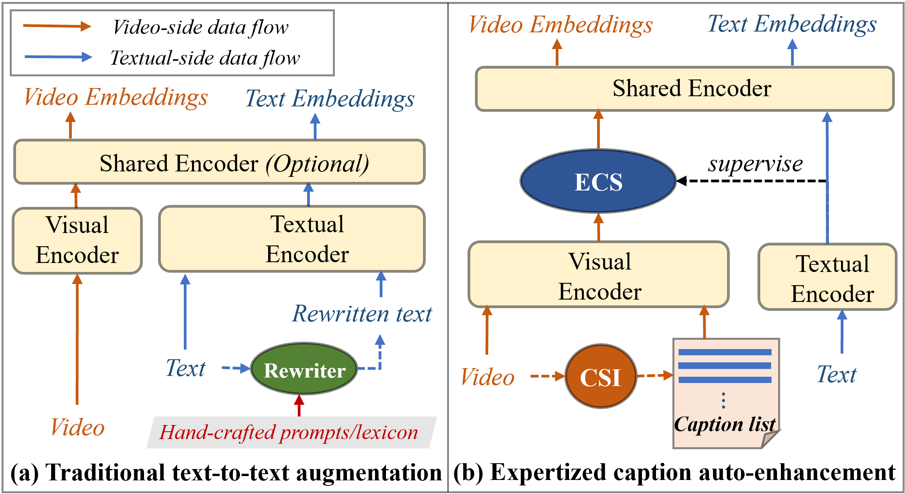

# Expertized Caption Auto-Enhancement for Video-Text Retrieval (ECA4VTR)

[](https://arxiv.org/abs/2502.02885)

This repository contains the core model implementation for the paper *"Expertized Caption Auto-Enhancement for Video-Text Retrieval"*. 

> 🔔 **Note:** This is a preliminary release containing key architectural components. Full training/evaluation code and pre-trained models will be released upon paper acceptance.


## 📖 Introduction
We propose a novel framework to reduce the modality comprehension gap in Video-Text Retrieval (VTR) by enhancing visual expressions instead of text rewriting. Our key innovations include:

- **CSI Module**: Automatically refines query prompts to generate high-quality video captions with rich semantic diversity
- **ESC Module**: Learnable experts automatically select optimal expression perspectives for cross-modal matching
- **Non-empirical Framework**: Achieves state-of-the-art performance on MSR-VTT (67.7% R@1), MSVD (59.2% R@1) and DiDemo (62.0% R@1)



## 🧠 Core Innovation
**Modality Gap Reduction Framework**:
- **Expert Selector**:  
  `code/moe_fusion.py` contains the multi-expert architecture with dynamic perspective selection
- **Main Model**:  
  `code/model.py` Complete video-text alignment framework


## 📜 Citation 
**If you use this work in your research, please cite:**

*Baoyao Yang, Junxiang Chen, Wanyun Li, Wenbin Yao.*  
**Expertized Caption Auto-Enhancement for Video-Text Retrieval**  
*arXiv preprint arXiv:2502.02885 (2024)*  
[[Paper Link]](https://arxiv.org/abs/2502.02885)*

**BibTeX Format:**
```bibtex
@article{yang2024expertized,
  title={Expertized Caption Auto-Enhancement for Video-Text Retrieval},
  author={Yang, Baoyao and Chen, Junxiang and Li, Wanyun and Yao, Wenbin},
  journal={arXiv preprint arXiv:2502.02885},
  year={2024}
}